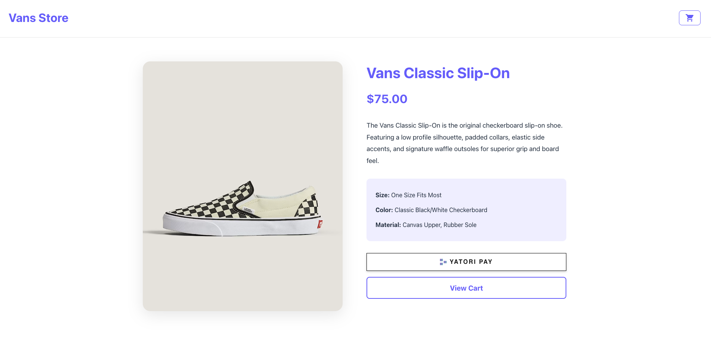
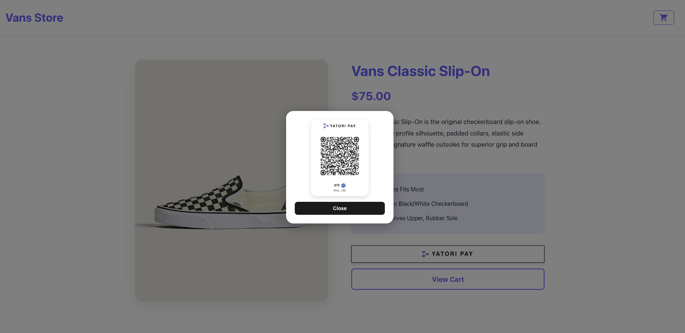

# React Example - Solana Payment Demo

A complete e-commerce demo showcasing the **YATORI CHECKOUT** component for seamless Solana payments. This demo includes a product page, CHECKOUT flow, and success page with transaction receipt.

  

## 📸 Screenshots





## 📋 Table of Contents

- [Overview](#overview)
- [YATORI CHECKOUT Component](#yatori-checkout-component)
- [Features](#features)
- [Installation](#installation)
- [Quick Start](#quick-start)
- [Component API](#component-api)
- [Usage Examples](#usage-examples)
- [Project Structure](#project-structure)
- [Configuration](#configuration)
- [Development](#development)

## 🎯 Overview

This demo application demonstrates how to integrate YATORI CHECKOUT into a React e-commerce application. It includes:

- **Product Page**: Display products with integrated YATORI CHECKOUT button
- **CHECKOUT Page**: Full CHECKOUT flow with order summary and payment
- **Success Page**: Order confirmation with transaction receipt and Solscan link

## 💳 YATORI CHECKOUT Component

YATORI CHECKOUT is a React component that provides a seamless Solana payment experience. It handles wallet connection, transaction signing, and payment processing in a single, easy-to-use component.

### Key Features

- 🔌 **Automatic Wallet Detection**: Supports Phantom, Solflare, and other Solana wallets
- 💰 **Direct Payment Processing**: Handles transaction creation and signing
- ✅ **Transaction Confirmation**: Provides transaction signature and status
- 🎨 **Customizable Styling**: Easy to integrate into any design
- 🔒 **Secure**: All transactions are signed by the user's wallet

## ✨ Features

- 🛍️ **Product Display**: Beautiful product page with image and details
- 💳 **Dual CHECKOUT Options**: 
  - Direct YATORI CHECKOUT on product page
  - Traditional cart → CHECKOUT flow
- 🛒 **Shopping Cart**: Cart icon navigation
- 📄 **Order Receipt**: Detailed success page with transaction signature
- 🔗 **Solscan Integration**: Direct links to view transactions on Solscan
- 📱 **Responsive Design**: Works on desktop and mobile devices

## 🚀 Installation

### Prerequisites

- Node.js 18+ and npm
- A Solana wallet extension (Phantom, Solflare, etc.)
- Basic knowledge of React and TypeScript

### Install Dependencies

```bash
npm install
```

This will install:
- React 19.2.0
- YATORI CHECKOUT component
- React Router DOM

## ⚡ Quick Start

Start the development server:

```bash
npm run dev
```

Access the application at http://localhost:5173 (or the port Vite assigns)

## 📚 Component API

### YatoriCheckout Props

| Prop | Type | Required | Description |
|------|------|----------|-------------|
| `wallet` | `string` | ✅ | Solana wallet address to receive payments |
| `amount` | `number` | ✅ | Payment amount in SOL |
| `onYatoriConfirmed` | `(event: CustomEvent) => void` | ✅ | Callback fired when payment is confirmed |
| `onYatoriAnimationComplete` | `(event: CustomEvent) => void` | ❌ | Callback fired when animation completes (use to navigate to success page) |
| `className` | `string` | ❌ | Optional CSS class for styling |

### Event Detail Structure

When `onYatoriConfirmed` is called, the event detail contains:

```typescript
{
  signature: string;  // Transaction signature
  status: string;     // Transaction status (e.g., "confirmed")
}
```

When `onYatoriAnimationComplete` is called, the event detail contains:

```typescript
{
  signature: string;  // Transaction signature
}
```

## 💻 Usage Examples

### Basic Integration

```tsx
import { YatoriCheckout } from 'yatori-checkout/react';

function ProductPage() {
  const merchantWallet = 'YOUR_SOLANA_WALLET_ADDRESS';
  const productPrice = 0.75;

  const handlePayment = (event) => {
    const { signature, status } = event.detail;
    console.log('Payment confirmed!', { signature, status });
    // Handle successful payment
  };

  return (
    <YatoriCheckout
      wallet={merchantWallet}
      amount={productPrice}
      onYatoriConfirmed={handlePayment}
    />
  );
}
```

### With Navigation to Success Page

```tsx
import { YatoriCheckout } from 'yatori-checkout/react';
import { useNavigate } from 'react-router-dom';

function CheckoutPage() {
  const navigate = useNavigate();
  const merchantWallet = 'YOUR_SOLANA_WALLET_ADDRESS';
  const productPrice = 0.75;

  const handleConfirmation = (event) => {
    const { signature, status } = event.detail;
    console.log('Payment confirmed!', { signature, status });
  };

  const handleAnimationComplete = (event) => {
    const { signature } = event.detail;
    // Navigate to success page with signature
    navigate('/success', { 
      state: { 
        signature,
        productPrice 
      } 
    });
  };

  return (
    <YatoriCheckout
      wallet={merchantWallet}
      amount={productPrice}
      onYatoriConfirmed={handleConfirmation}
      onYatoriAnimationComplete={handleAnimationComplete}
    />
  );
}
```

### Multiple CHECKOUT Options

```tsx
function ProductPage() {
  const navigate = useNavigate();
  const merchantWallet = 'YOUR_SOLANA_WALLET_ADDRESS';
  const productPrice = 0.75;

  return (
    <div className="product-buttons">
      {/* Direct CHECKOUT */}
      <YatoriCheckout
        wallet={merchantWallet}
        amount={productPrice}
        onYatoriConfirmed={handleDirectPayment}
      />
      
      {/* View cart option */}
      <button onClick={() => navigate('/checkout')}>
        View Cart
      </button>
    </div>
  );
}
```

## 📁 Project Structure

```
yatori-checkout-react-template/
├── src/
│   ├── pages/
│   │   ├── ProductPage.tsx      # Product page with YATORI CHECKOUT
│   │   ├── ProductPage.css      # Product page styles
│   │   ├── CheckoutPage.tsx     # Full CHECKOUT page
│   │   ├── CheckoutPage.css     # CHECKOUT page styles
│   │   ├── SuccessPage.tsx      # Success page with receipt
│   │   └── SuccessPage.css      # Success page styles
│   ├── types/
│   │   └── index.ts             # TypeScript type definitions
│   ├── App.tsx                  # Main app component with routing
│   ├── App.css                  # Global app styles
│   ├── main.tsx                 # Application entry point
│   └── index.css                # Global styles
├── public/
│   ├── classic-slipon.avif      # Product image
│   ├── react-screenshot-one.png # Screenshot one
│   └── react-screenshot-two.png # Screenshot two
├── package.json                 # Dependencies and scripts
└── README.md                   # This file
```

## ⚙️ Configuration

### Merchant Wallet Address

Update the merchant wallet address in your components:

**ProductPage.tsx:**
```typescript
const merchantWallet = 'YOUR_SOLANA_WALLET_ADDRESS';
```

**CHECKOUTPage.tsx:**
```typescript
const merchantWallet = 'YOUR_SOLANA_WALLET_ADDRESS';
```

### Product Price

Update product prices in:
- `src/pages/ProductPage.tsx`
- `src/pages/CHECKOUTPage.tsx`

```typescript
const productPrice = 0.75; // Price in SOL
```

## 🛠️ Development

### Available Scripts

```bash
# Start development server
npm run dev

# Build for production
npm run build

# Run linter
npm run lint

# Preview production build
npm run preview
```

### Development Workflow

1. **Start Development Server**
   ```bash
   npm run dev
   ```

2. **Make Changes**
   - Edit React components in `src/pages/`
   - Update styles in `src/pages/*.css`

3. **Test the Flow**
   - Visit http://localhost:5173
   - Click "Proceed to CHECKOUT" or use YATORI button
   - Connect your Solana wallet
   - Complete payment
   - View transaction on success page with Solscan link

### Styling

The demo uses a clean white background with black text. Customize colors in:
- `src/index.css` - Global styles
- `src/pages/*.css` - Page-specific styles

Key color variables:
- Primary: `#646cff`
- Background: `#ffffff`
- Text: `#213547`

## 🔒 Security Considerations

1. **Use HTTPS**: In production, always use HTTPS to protect user data.

2. **Verify Transactions**: The transaction signature is provided by the component. You can verify transactions on-chain using Solana Web3.js or view them on Solscan using the provided link.

3. **Validate Amounts**: Ensure the transaction amount matches your expected price before processing orders.

4. **Check Recipient**: Verify the transaction recipient matches your merchant wallet address.

## 📝 Notes

- This is a **demo application** for testing and development purposes
- Transactions are processed on **Solana mainnet-beta** (real SOL)
- Make sure you have a **Solana wallet extension** installed (Phantom, Solflare, etc.)
- Replace the placeholder merchant wallet address with your actual wallet
- Transaction signatures can be verified on Solscan using the provided link

## 🤝 Contributing

This is a demo template. Feel free to fork and customize for your needs!

## 📄 License

MIT

## 🔗 Resources

- [Solana Documentation](https://docs.solana.com/)
- [Solscan](https://solscan.io/) - View and verify transactions
- [React Documentation](https://react.dev/)
- [Vite Documentation](https://vite.dev/)

## 💬 Support

For issues or questions about YATORI CHECKOUT, please refer to the component documentation or contact the YATORI team.

---

**Built with ❤️ using YATORI CHECKOUT**
